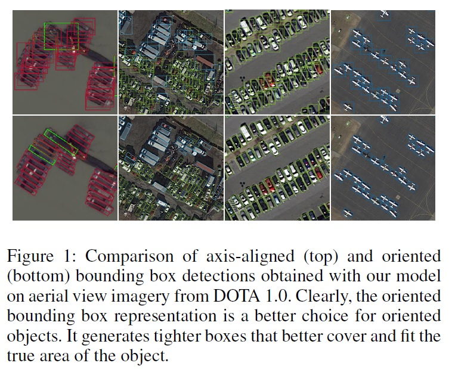
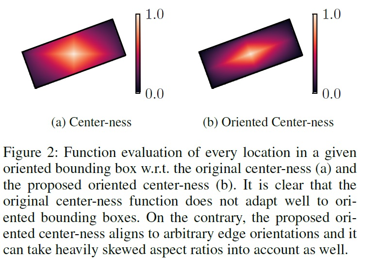
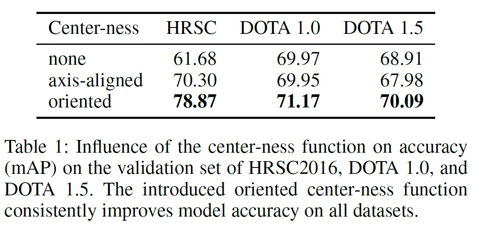
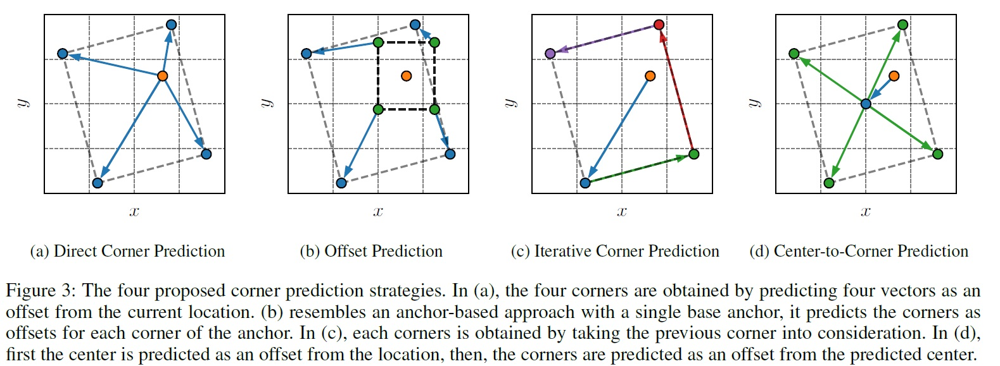
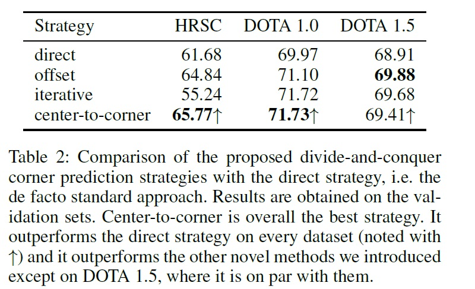
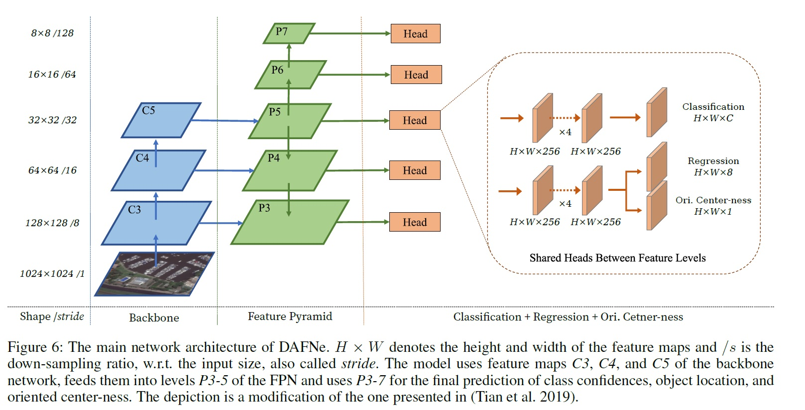
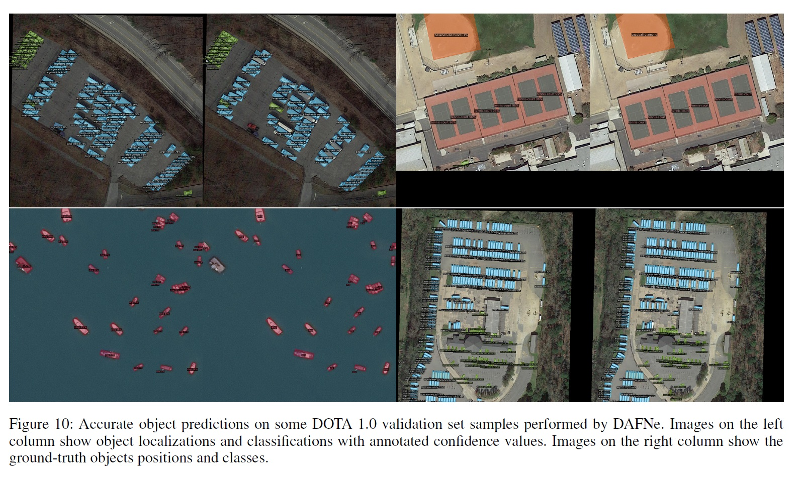
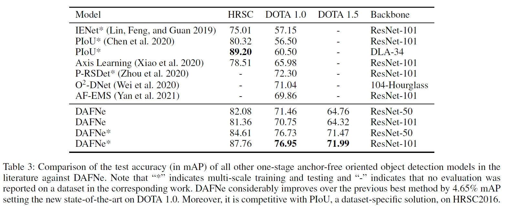

## 文献タイトル
DAFNe: A One-Stage Anchor-Free Deep Model for Oriented Object Detection

## 論文リンク
https://arxiv.org/abs/2109.06148

## 著者/所属機関
Steven Lang,1 Fabrizio Ventola,1 Kristian Kersting1,2
1 TU Darmstadt, Darmstadt, Germany
2 Hessian Center for AI and Centre for Cognitive Science, Darmstadt, Germany
{fsteven.lang, ventola, kerstingg}@cs.tu-darmstadt.de

## 発表年
2021

## キーワード
computer vision, object detection, oriented bounding box, anchor-free

## どんなもの？
バウンディングボックスを傾けた物体検出手法。
DAFNe: A Dense one-stage Anchor-Free deep Network for oriented object detection.

## 先行研究と比べてどこがすごい？

## 技術や手法のキモはどこ？
* one-stageモデルであり、入力画像上の密なグリッド上で予測を行うため、two-stageモデルに比べて設計がシンプル
* バウンディングボックスのアンカーを使用しないことで、予測の複雑さを軽減
* 任意の向きのバウンディングボックスに対するcenter-ness functionの向きを考慮した一般化により、予測の低品質化を軽減
* 中心からコーナーへのバウンディングボックス予測戦略を導入することで、物体のローカライズ性能を向上

## どうやって有効だと検証した？
* DOTA1.0データセットで76.95%mAP (従来の最良の結果よりも4.65%mAP高い)
* DOTA 1.5データセットで87.76%mAP
* HRSC2016で87.76%mAP

## 議論はある？

## 次に読むべき論文は？

## その他
コードあり https://github.com/steven-lang/DAFNe

---
## 傾いていないバウンディングボックスと傾いたバウンディングボックスを使った検出の比較

## center-ness function

## corner prediction strategies

## network architecture

## 検出例とground-truth

## Comparison of the test accuracy (in mAP)

