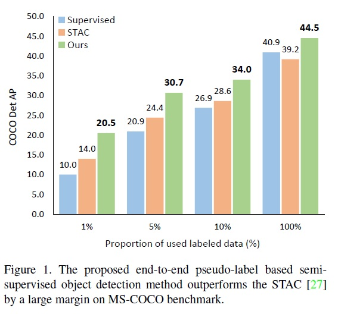
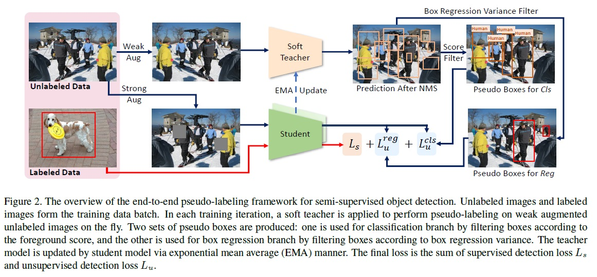
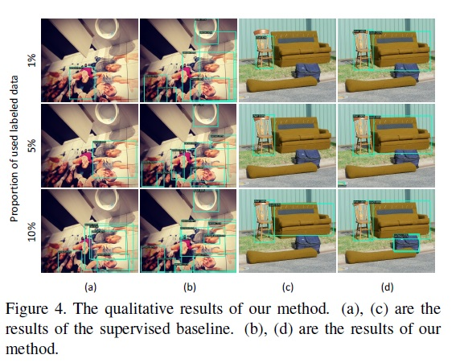
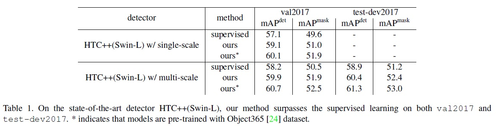

## 文献タイトル
End-to-End Semi-Supervised Object Detection with Soft Teacher

## 論文リンク
https://arxiv.org/abs/2106.09018

## 著者/所属機関
Mengde Xu1 Zheng Zhang1,2 Han Hu2 Jianfeng Wang2 Lijuan Wang2 Fangyun Wei2
Xiang Bai1 Zicheng Liu2  
1 Huazhong University of Science and Technology  
fmdxu,xbaig@hust.edu.cn  
2 Microsoft  
fzhez,hanhu,jianfw,lijuanw,fawe,zliug@microsoft.com

## 発表年
2021

## キーワード
computer vision, object detection, semi-supervised, soft teacher

## どんなもの？
End-to-Endの半教師あり物体検出手法

## 先行研究と比べてどこがすごい？

## 技術や手法のキモはどこ？
* ラベルのないバウンディングボックスの分類損失を、教師ネットワークが生成した分類スコアで重み付けするソフト教師メカニズム
* ボックス回帰の学習のための信頼できる擬似ボックスを選択するボックスジッタリングアプローチ

## どうやって有効だと検証した？
* MS COCOデータセットで検証
    * 様々な条件下、例えばラベリング率が1％，5％，10％で，従来の手法を大きく上回る結果
    * COCOの全学習セットを用いて学習したベースライン検出器の40.9 mAPを，COCOの123Kのラベルなし画像を活用することで，3.6 mAP改善し，44.5 mAPを達成
    * Swin Transformerベースのstate-of-the-artのオブジェクト検出器（test-devでは58.9mAP）では、検出精度を1.5mAP改善して60.4mAPを達成し、インスタンスセグメンテーションでは1.2mAP改善して52.4mAPを達成
    * Object365の学習済みモデルを組み込むことで、検出精度 61.3mAP、インスタンスセグメンテーション精度 53.0mAPを達成し、state-of-the-art

## 議論はある？

## 次に読むべき論文は？

## その他
コードあり https://github.com/microsoft/SoftTeacher

---
## 提案手法と従来手法の比較
  

## End-to-End疑似ラベリングのフレームワーク
  

## 定性的結果
  

## 定量的結果
  
  

